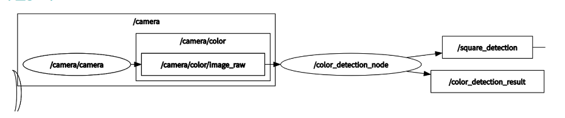
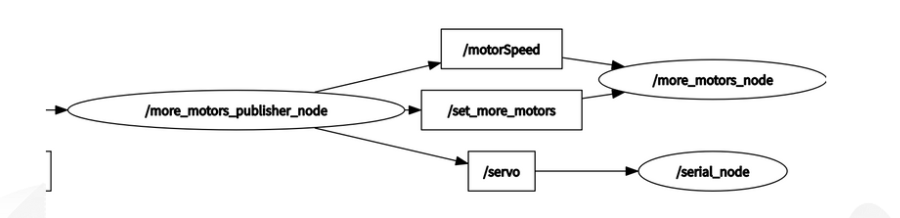

# RMC_PROJECT

## 视频展示

<video>
  <source src="README.assets/grasp.mp4" type="video/mp4">
  Your browser does not support the video tag.
</video>

https://github.com/yupose-martin/rmc_project/assets/114896246/56ec8f8a-1966-4bbf-9b04-a421e8012af1


## ros机械臂启动流程

* 文件：rmc_ws/src/DynamixelSDK/ros/dynamixel_sdk_examples/src
* rosrun rosserial_python serial_node.py _port:=/dev/ttyACM0 _baud:=57600(启动arduino)
* rosrun dynamixel_sdk_examples more_motors_node (前置项)
* rosrun dynamixel_Sdk_examples more_motors_publisher  (选择一，直接抓取)
* rosun dynamixel_sdk_examples move_down_grasp (选择二，向下垂直抓取)

## camera启动

1.roslaunch astra_camera astra_pro.launch开摄像头

2.rqt_image_view 开图像查看器

3.rosrun astra_camera colortest开主程序

4.rostopic echo /square_detection监听消息（pointstamp）
rostopic echo test（string简化版）

5.rqt topic选/color_detection_result查看处理后图像，/camera/color/image_raw查看原图，/adjusted_image查看掩码处理后图像

## 参考库

* https://github.com/ROBOTIS-GIT/DynamixelSDK 舵机驱动
* https://github.com/orbbec/ros_astra_camera 相机驱动

## 主要程序

* ./src/DynamixelSDK/ros/dynamixel_sdk_examples/src/more_motors.cpp(控制舵机)
* ./src/DynamixelSDK/ros/dynamixel_sdk_examples/src/more_motors_publish.cpp（直接抓取主程序）
* ./src/DynamixelSDK/ros/dynamixel_sdk_examples/src/move_down_grasp.cpp（向下抓取主程序）
* ./arduino_node/ServoControl.pde(arduino_ros，控制夹爪)
* ./src/ros_astra_camera/src/colortest.cpp(颜色识别)

## rqt_graph





## AX-12A参数：

```c++
AX-12A参数：
// Control table address
#define ADDR_TORQUE_ENABLE    24
#define ADDR_GOAL_POSITION    30
#define ADDR_PRESENT_POSITION 36

// Protocol version
#define PROTOCOL_VERSION      1.0             // Default Protocol version of DYNAMIXEL X series.

// Default setting  id先用dynamixel wizard扫描看id
#define DXL1_ID               1               // DXL1 ID
#define DXL2_ID               9               // DXL2 ID
#define BAUDRATE              1000000           // Default Baudrate of DYNAMIXEL X series
#define DEVICE_NAME           "/dev/ttyUSB0"  
// [Linux] To find assigned port, use "$ ls /dev/ttyUSB*" command 根据显示更改usb
```

## 一些注意事项

* 8号电机 真实id其实是1号

##### 电机角度（512是中心） position308 = 90du=0.5pi=1.57079632679       3.422222position = 1du

x * 196.07888989 = position change

1. 使用的电机: 6  2  1  12
1. 稳定的电机：
   * 8（1） 9 12 6 5 1 2
   * 较小范围: 6 9 12
   * 较大范围: 8(1) 1  2
2. 范围从820-204
   * id:  16 9 8(实际是1) 6 12
3. 范围从1024-0
   * id: 14 2 1
4. 没测试的电机： 1 2 3 5

## github


### address of AX-12A


## 错误反思

* 经常出现在catkin_Ws里面也有包，然后在另外一个包里也有这个包，执行的时候，发现修改代码编译执行之后效果不变。
