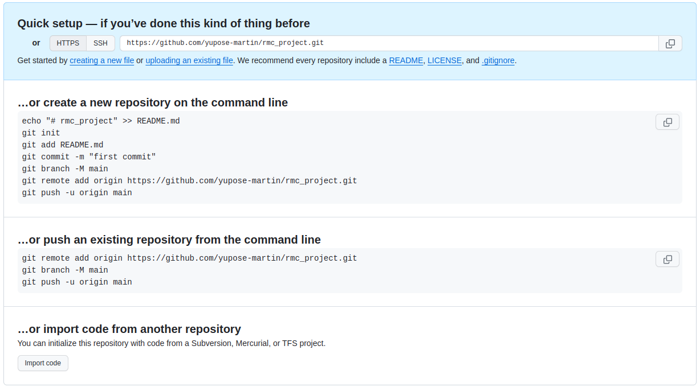
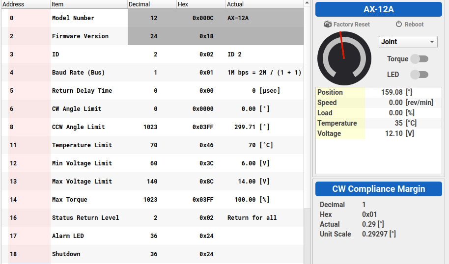
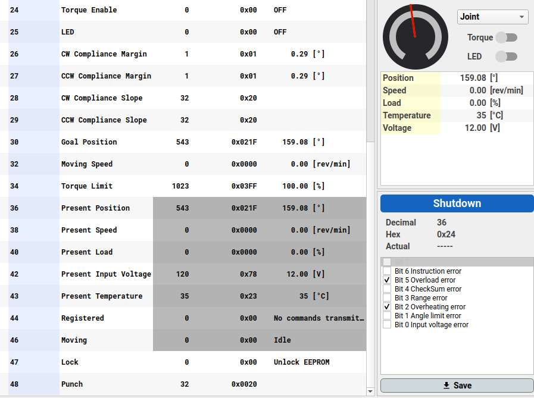

# RMC_PROJECT

## ros启动流程

* 文件：rmc_ws/src/DynamixelSDK/ros/dynamixel_sdk_examples/src
* rosrun dynamixel_sdk_examples ...

## AX-12A参数：

```c++
AX-12A参数：
// Control table address
#define ADDR_TORQUE_ENABLE    24
#define ADDR_GOAL_POSITION    30
#define ADDR_PRESENT_POSITION 36

// Protocol version
#define PROTOCOL_VERSION      1.0             // Default Protocol version of DYNAMIXEL X series.

// Default setting  id先用dynamixel wizard扫描看id
#define DXL1_ID               1               // DXL1 ID
#define DXL2_ID               9               // DXL2 ID
#define BAUDRATE              1000000           // Default Baudrate of DYNAMIXEL X series
#define DEVICE_NAME           "/dev/ttyUSB0"  
// [Linux] To find assigned port, use "$ ls /dev/ttyUSB*" command 根据显示更改usb
```

## 一些注意事项

* 8号电机 真实id其实是1号

##### 电机角度（512是中心）

1. 稳定的电机:
   * 8（1） 9 12 6 5 1 20000000
   * 较小范围: 6 9 12
   * 较大范围: 8(1) 1  2
2. 范围从820-204
   * id:  16 9 8(实际是1) 6
3. 范围从1024-0
   * id: 14 12
4. 没测试的电机： 1 2 3 5

## github




* 抓取姿态：2：512       6：700     12：717
* 转移姿态：


### address of AX-12A




